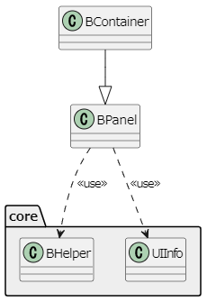
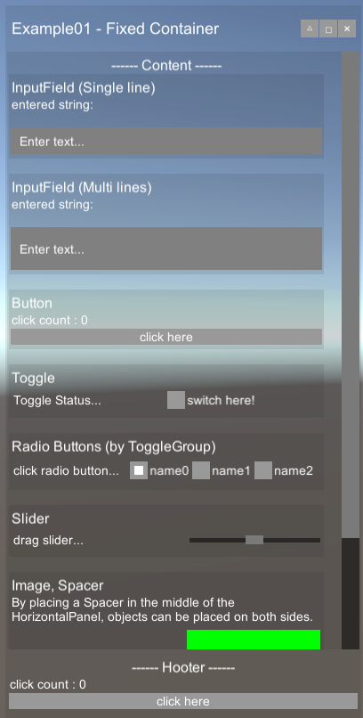
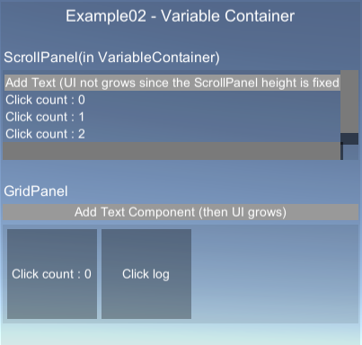

# uBUI (uGUI BUIlder)

A library to help with simple uGUI setups.


# Install to your project

Copy `Assets/Scripts/uBUI` folder to your project code.


# Run Example

Open Root folder as Unity Project & Run.

(The sample program is started with the "Example01/02" Component of the "GO_Example" game object.)


# Concept of window assembly

**Overview of class dependencies**



## BContainer

- A wrapper class that holds the canvas and the top-level LayoutGroup.
- Since it inherits from BPanel, this can construct windows in the same way.
- Container Mode
  - Fixed Container Mode
    - Top Down UI design
    - Container size is fixed, so Components are adjusted to fit.

  - Variable Container Mode
    - Bottom UP UI design.
    - Container grows to fit component, so that all components are large enough (i.e. Problems such as cut off text do not occur).

- Place UI in world space

  - if `isScreenMode`  is false, UI is set in world space.
  - ex. `BContainer.Create(isScreenMode: false,...`


## BPanel

- A wrapper class that holds a LayoutGroup.
- To add components, use `AddXXX` methods.
  - ex. `bpanel.AddText("text to show.");`

- Almost immutable
  - Editing chain methods return an edited copy of the original object, leaving the original unchanged.
  - Fields are publicly accessible (for convenience), so they are not fully immutable.

## UIInfo

- A data class that holds component settings.
- Based on the defaults for each component, create the necessary settings by rewriting only the necessary parts in the method chain.

## BHelper

- A utility class that collects uGUI low-level operations that form the basis of this library.
- Basically no need to use.


# Usage Example

## Example01 - Fixed Container, WindowStyle, Components



This window is assembled by the following code.

(Same to `Assets/Scripts/Example01.cs`)

```c#
using uBUI;
using System.Collections.Generic;
using UnityEngine;
using UnityEngine.UI;

public class Example01 : MonoBehaviour
{
    void Start()
    {
        string Title = "Example01 - Fixed Container";
        var (window_size, window_leftbottom) = (new Vector2(400, 800), new Vector2(20, 20));

        var container = BContainer.Create(isScreenMode: true, Title,
            uiInfo: UIInfo.BCONTAINER_DEFAULT.rtAnchoredPosition(window_leftbottom).rtSizeDelta(window_size).spacing(5));

        // ************************ header ************************
        var headerRoot = container.AddVerticalPanel();
        var header = headerRoot.AddHorizontalPanel();
        header.AddText(Title, UIInfo.TEXT_H1.leFlexWeight(1, 0));

        // △ Basic Position
        var uiCaption = UIInfo.BUTTON_CAPTION;
        header.AddButton(() => { container.locate_byPosition(left: window_leftbottom.x, bottom: window_leftbottom.y, width: window_size.x, height: window_size.y); },
            labelStr: "△", uiInfo: uiCaption);
        // □ Maximize
        header.AddButton(() => { container.locate_byMarginPx(left: 10, right: 10, top: 10, bottom: 10); }, labelStr: "□"
            , uiInfo: uiCaption);
        // × Hide
        header.AddButton(() => { container.gameObject.SetActive(false); }, labelStr: "×"
            , uiInfo: uiCaption);

        // ************************ Content ************************
        BPanel content = container.AddScrollPanel(LayoutType.Vertical, UIInfo.SCROLLVIEW_DEFAULT);

        UIInfo uiTitle = UIInfo.TEXT_H2;
        UIInfo uiDesc = UIInfo.TEXT_DEFAULT.textSize(14).lePreferredSize(350, 0);

        content.AddText("------ Content ------", uiTitle.textAlignment(TextAnchor.MiddleCenter));
        {
            var vp = content.AddVerticalPanel(UIInfo.PANEL_DARK);
            vp.AddText("InputField (Single line)", uiTitle);
            string initialText = "entered string: \r\n";
            Text log = vp.AddText(initialText);
            vp.AddTextField(onEndEdit: s => log.text += "\r\n---\r\n\r\n", onValueChanged: s => log.text = $"{initialText}{s}\r\n");
        }
        content.AddSpacer();

        {
            var vp = content.AddVerticalPanel(UIInfo.PANEL_DARK);
            vp.AddText("InputField (Multi lines)", uiTitle);
            string initialText = "entered string: \r\n";
            Text log = vp.AddText(initialText);
            vp.AddTextField(onEndEdit: s => log.text += "\r\n---\r\n\r\n", onValueChanged: s => log.text = $"{initialText}{s}\r\n", areaLines: 2);
        }
        content.AddSpacer();
        {
            var vp = content.AddVerticalPanel(UIInfo.PANEL_DARK);
            vp.AddText("Button", uiTitle);
            Text log = vp.AddText("click count : 0");
            int clickCount = 0;
            vp.AddButton(() =>
            {
                clickCount++;
                log.text = $"click count : {clickCount}";
            }
            , "click here");
        }
        content.AddSpacer();
        {
            var vp = content.AddVerticalPanel(UIInfo.PANEL_DARK);
            vp.AddText("Toggle", uiTitle);
            BPanel hp = vp.AddHorizontalPanel();
            Text textToggleStatus = hp.AddText("Toggle Status...");
            hp.AddToggle(b => textToggleStatus.text = "Toggle Status :" + (b ? "ON" : "OFF"), "switch here!", isOn: false);
        }
        content.AddSpacer();

        {
            var vp = content.AddVerticalPanel(UIInfo.PANEL_DARK);
            vp.AddText("Radio Buttons (by ToggleGroup)", uiTitle);
            BPanel hp = vp.AddHorizontalPanel();
            Text text_radio = hp.AddText("click radio button...");

            hp.AddRadioButton(s => text_radio.text = "selected :" + s,
                showValueDict: new Dictionary<string, string>()
                    {
                        {"name0","value0" },
                        {"name1","value1" },
                        {"name2","value2" },
                    },
                layoutGroup: LayoutType.Horizontal);
        }
        content.AddSpacer();
        {
            var vp = content.AddVerticalPanel(UIInfo.PANEL_DARK);
            vp.AddText("Slider", uiTitle);
            BPanel hp = vp.AddHorizontalPanel();
            Text text_slider = hp.AddText("drag slider...");
            hp.AddSlider(f => text_slider.text = "value :" + f.ToString());
        }
        content.AddSpacer();

        {
            var vp = content.AddVerticalPanel(UIInfo.PANEL_DARK);
            vp.AddText("Image, Spacer", uiTitle);
            vp.AddText("By placing a Spacer in the middle of the HorizontalPanel, objects can be placed on both sides.", uiDesc);
            BPanel hp = vp.AddHorizontalPanel(UIInfo.PANEL_DEFAULT.layoutAlignment(TextAnchor.LowerRight));
            hp.AddImage(uiInfo: UIInfo.IMAGE_DEFAULT.lePreferredSize(100).bgColor(Color.red));
            hp.AddSpacer();
            hp.AddImage(uiInfo: UIInfo.IMAGE_DEFAULT.lePreferredSize(150).bgColor(Color.green));
        }
        content.AddSpacer();

        // ************************ Hooter ************************
        var hooter = container.AddVerticalPanel();
        hooter.AddText("------ Hooter ------", uiTitle.textAlignment(TextAnchor.MiddleCenter));
        {
            Text log = hooter.AddText("click count : 0");
            int clickCount = 0;
            hooter.AddButton(() =>
            {
                clickCount++;
                log.text = $"click count : {clickCount}";
            }
            , "click here");
        }
    }
}


```


## Example02 - Variable Container



```c#
using uBUI;
using System.Collections.Generic;
using UnityEngine;
using UnityEngine.UI;

public class Example02 : MonoBehaviour
{
    void Start()
    {
        string Title = "Example02 - Variable Container";
        var (window_size, window_leftbottom) = (new Vector2(400, 0), new Vector2(420, 420));

        var container = BContainer.Create(isScreenMode: true, Title, ContainerMode.VARIABLE,
            uiInfo: UIInfo.BCONTAINER_DEFAULT.spacing(5).layoutAlignment(TextAnchor.UpperLeft)
                .rtAnchoredPosition(window_leftbottom).lePreferredSize(window_size));

        container.AddText(Title, UIInfo.TEXT_H1.textAlignment(TextAnchor.MiddleCenter));
        container.AddSpacer();
        { // Scroll Panel
            container.AddText("ScrollPanel(in VariableContainer)", UIInfo.TEXT_H2);
            BPanel content = container.AddScrollPanel(LayoutType.Vertical, UIInfo.SCROLLVIEW_DEFAULT.lePreferredSize(new Vector2(0, 100)));
            content.AddText("UI not grows since the ScrollPanel size is fixed.");
            int clickCount = 0;
            content.AddButton(() =>
            {
                clickCount++;
                add();
            }
            , "Add Text");
            add();
            container.AddSpacer();
            void add() { content.AddText($"Click count : {clickCount}"); }
        }

        { // Grid Layout
            container.AddText("GridPanel", UIInfo.TEXT_H2);
            BPanel gp = null;
            int clickCount = 0;
            UIInfo uiGridCell = UIInfo.TEXT_DEFAULT.rtSizeDelta(100).bgColor(new Color(0f, 0f, 0f, 0.3f)).textAlignment(TextAnchor.MiddleCenter);
            container.AddButton(() =>
            {
                clickCount++;
                add();
            }
            , "Add Text Component (then UI grows)");
            gp = container.AddGridPanel(uiInfo: UIInfo.PANEL_DARK.spacing(5).constraintCount(2));
            add();
            container.AddSpacer();

            void add()
            {
                gp.AddText($"Click count : {clickCount}", uiGridCell);
                gp.AddText("Click log", uiGridCell);
            }
        }
    }
}

```


# --- Specifications ---

# UIInfo

### **LayoutElement Attributes**

| **UIInfo**             | **LayoutElement correspondence**           |
| ---------------------- | ------------------------------------------ |
| **leFlexibleWeight**   | LayoutElement#flexibleWidth/flexibleHeight |
| **leMinSize　※**       | LayoutElement#minWidth/Height              |
| **lePreferredSize　※** | LayoutElement#preferredWidth/Height        |

※When 0, do not assign values to attributes of LayoutElement


