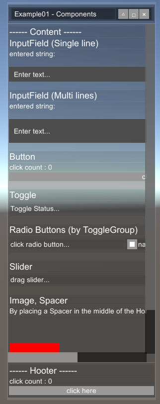

# UGUISimpleWindow

Library that can assemble Window-based uGUI


# Components


# Install

Copy `Assets/Scripts/uGUISimpleWindow` folder to your project code.


# Usage Example




This window is assembled by the following code.

(Same to `Assets/Scripts/Example01.cs`)

```c#
using uGUISimpleWindow;
using System.Collections.Generic;
using UnityEngine;
using UnityEngine.UI;


public class Example01 : MonoBehaviour
{
    void Start() { example01(); }

    private void example01()
    {
        var (window_width, window_height, window_left, window_bottom) = (300, 800, 420, 20);

        SWindow window = new SWindow();
        window.init_onScreen("Example01 - Components", leftbottom: new Vector2(window_left, window_bottom), windowSize: new Vector2(window_width, window_height), hooterLayout: LayoutType.Vertical);

        // ************************ Caption buttons ************************
        // △ Basic Position
        var uiCaption = UIInfo.BUTTON_DEFAULT.fit_Fixed().uiSize(new Vector2(20, 20));
        window.caption.addButton(() => { window.locate_byPosition(left: window_left, bottom: window_bottom, width: window_width, height: window_height); },
            labelStr: "△", uiInfo: uiCaption);
        // □ Maximize
        window.caption.addButton(() => { window.locate_byMarginPx(left: 10, right: 10, top: 10, bottom: 10); }, labelStr: "□"
            , uiInfo: uiCaption);
        // × Hide
        window.caption.addButton(() => { window.SetActive(false); }, labelStr: "×"
            , uiInfo: uiCaption);


        // ************************ Content ************************
        SPanel content = window.content;

        UIInfo uiTitle = UIInfo.TEXT_DEFAULT.textSize(18);
        UIInfo uiDesc = UIInfo.TEXT_DEFAULT.textSize(14);

        content.addText("------ Content ------", uiTitle.layoutAlignment(TextAnchor.MiddleCenter));
        {
            content.addText("InputField (Single line)", uiTitle);
            string initialText = "entered string: \r\n";
            Text log = content.addText(initialText);
            content.addTextField(onEndEdit: s => log.text += "\r\n---\r\n\r\n", onValueChanged: s => log.text = $"{initialText}{s}\r\n");
            content.addSpacer();
        }

        {
            content.addText("InputField (Multi lines)", uiTitle);
            string initialText = "entered string: \r\n";
            Text log = content.addText(initialText);
            content.addTextField(onEndEdit: s => log.text += "\r\n---\r\n\r\n", onValueChanged: s => log.text = $"{initialText}{s}\r\n", lineCount: 2);
            content.addSpacer();
        }
        {
            content.addText("Button", uiTitle);
            Text log = content.addText("click count : 0");
            int clickCount = 0;
            content.addButton(() =>
            {
                clickCount++;
                log.text = $"click count : {clickCount}";
            }
            , "click here");
            content.addSpacer();
        }
        {
            content.addText("Toggle", uiTitle);
            SPanel hp = content.addPanel_Horizontal();
            Text textToggleStatus = hp.addText("Toggle Status...");
            hp.addToggle(b => textToggleStatus.text = "Toggle Status :" + (b ? "ON" : "OFF"), "switch here!", isOn: false);
            content.addSpacer();
        }

        {
            content.addText("Radio Buttons (by ToggleGroup)", uiTitle);
            SPanel hp = content.addPanel_Horizontal();
            Text text_radio = hp.addText("click radio button...");

            hp.addRadioButton(s => text_radio.text = "selected :" + s,
                showValueDict: new Dictionary<string, string>()
                    {
                        {"name0","value0" },
                        {"name1","value1" },
                        {"name2","value2" },
                    },
                layoutGroup: LayoutType.Horizontal);
            content.addSpacer();
        }
        {
            content.addText("Slider", uiTitle);
            SPanel hp = content.addPanel_Horizontal();
            Text text_slider = hp.addText("drag slider...");
            hp.addSlider(f => text_slider.text = "value :" + f.ToString());
            content.addSpacer();
        }

        {
            content.addText("Image, Spacer", uiTitle);
            content.addText("By placing a Spacer in the middle of the HorizontalPanel, objects can be placed on both sides.", uiDesc.uiSize(new Vector2(window_width, 0)));
            SPanel hp = content.addPanel_Horizontal(UIInfo.PANEL_DEFAULT.layoutAlignment(TextAnchor.LowerRight));
            hp.addImage(size: new Vector2(100, 100), color: Color.red);
            hp.addSpacer();
            hp.addImage(size: new Vector2(150, 150), color: Color.green);
            content.addSpacer();
        }

        // ************************ Hooter ************************
        window.hooter.addText("------ Hooter ------", uiTitle.layoutAlignment(TextAnchor.MiddleCenter));
        {
            Text log = window.hooter.addText("click count : 0");
            int clickCount = 0;
            window.hooter.addButton(() =>
            {
                clickCount++;
                log.text = $"click count : {clickCount}";
            }
            , "click here");
        }
    }


}


```


